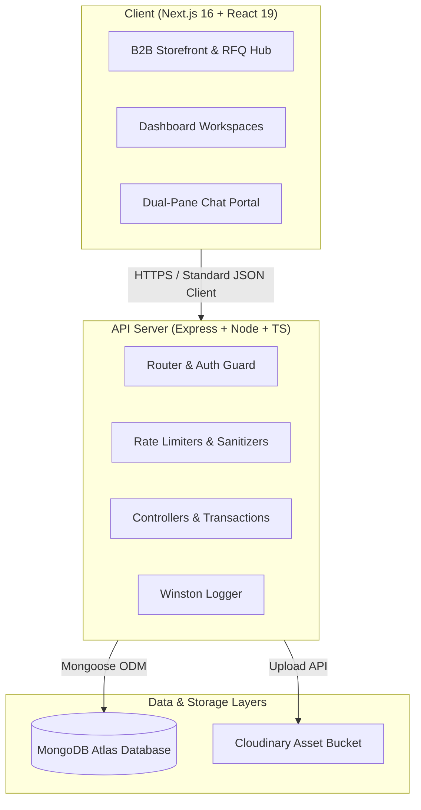

# WholeSaleIO — B2B Wholesale Bangladesh Marketplace

WholeSaleIO is a production-hardened B2B wholesale marketplace tailored for the Bangladesh ecosystem. It enables buyers to request quotes (RFQs) and purchase products directly from suppliers with tier-based pricing. It features rate limiting, helmet security headers, standard structured logging, comprehensive database indexing, soft deletes, audit logging, multi-document transactions, and a real-time messaging workspace.

---

## Technical Stack & Architecture



---

## Production Security & Resilience

1. **Security Headers & Sanitization:** Armed with `helmet` for strict HTTP response headers and `express-mongo-sanitize` to filter out malicious query parameters (preventing NoSQL injection attacks).
2. **Tiered Rate Limiting:** Enforces request quotas across the API space:
   - Global requests: 100 requests per 15 minutes.
   - Authentication (Login/Register): 5 requests per 15 minutes to deter brute-force.
   - Upload endpoints: 10 requests per minute to prevent resource exhaustion.
3. **Structured Winston Logging:** All diagnostic logs are mapped using standard JSON formatting to stdout for seamless aggregation (Splunk, Elastic, AWS CloudWatch). Logs capture request URI, HTTP methods, latency, and status codes.
4. **Environment Integrity:** Configuration values are validated at launch via `src/config/env.ts`, blocking server boot if vital secrets (JWT secret, DB connections) are absent.
5. **MongoDB Transactions:** Critical mutation operations—such as item stock reduction upon order placement or bid acceptance—are wrapped in atomic Mongoose transaction sessions.
6. **Soft Deletes:** Global `pre(/^find/)` middleware intercepts queries for User, Product, Order, and RFQ schemas to exclude objects marked as `isDeleted: true`.
7. **Audit Logging:** Logs key administrative and user actions inside a dedicated `AuditLog` collection, providing a clear history of state changes (verification, user deletion, status changes).

---

## Getting Started

### Prerequisites
- [Docker](https://www.docker.com/) & [Docker Compose](https://docs.docker.com/compose/)

### Running Locally with Docker Compose
The system is fully containerized and can be started with a single command:

```bash
docker-compose up --build
```

This starts:
1. **MongoDB Container** on port `27017`
2. **Backend API Server** on port `5000`
3. **Next.js Frontend Client** (configured for production-optimized standalone builds) on port `3000`

---

## Environment Configuration

### Backend (`/backend/.env`)
Create a `.env` file in the `backend/` directory:
```ini
PORT=5000
MONGO_URI=mongodb://localhost:27017/wholesale
JWT_SECRET=your_production_jwt_secret_256_bit
JWT_EXPIRES_IN=1d
CORS_ORIGIN=http://localhost:3000
CLOUDINARY_CLOUD_NAME=your_cloudinary_cloud_name
CLOUDINARY_API_KEY=your_cloudinary_api_key
CLOUDINARY_API_SECRET=your_cloudinary_api_secret
```

### Frontend (`/frontend/.env.local`)
Create a `.env.local` file in the `frontend/` directory:
```ini
NEXT_PUBLIC_API_URL=http://localhost:5000/api
```

---

## Database Schema & Indexes

To keep queries fast, compound and index keys are declared across Mongoose collections:
- **User:** `{ role: 1, isVerified: 1 }`
- **Product:** Text search index on `{ title: 'text', description: 'text' }`; filtering index on category, supplier, and pricing bounds.
- **RFQ:** `{ buyer: 1, status: 1 }`, `{ category: 1, status: 1 }`, `{ status: 1, createdAt: -1 }`.
- **Order:** `{ buyer: 1, createdAt: -1 }`, `{ supplier: 1, createdAt: -1 }`.
- **Message:** `{ sender: 1, receiver: 1, createdAt: -1 }`, `{ receiver: 1, read: 1 }`.
